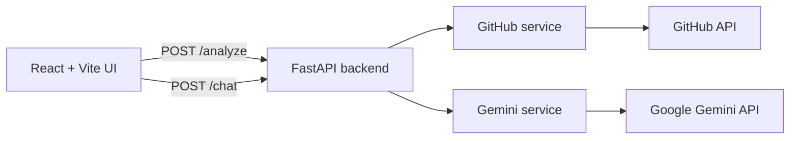

# CodeCompass


CodeCompass is a lightweight AI-powered onboarding tool. Paste a public GitHub repository URL, and the app will analyze the repository, generate a structured onboarding guide, and let you chat with an AI assistant about that codebase.

## Table of Contents

- [Project Overview](#project-overview)
- [Installation](#installation)
- [Clone the Repository](#clone-the-repository)
- [Git Basics](#git-basics)
- [Environment Variables](#environment-variables)
- [Running the Project](#running-the-project)
- [Project Structure](#project-structure)
- [Frontend Components](#frontend-components)
- [API Reference](#api-reference)
- [Backend Architecture](#backend-architecture)
- [Configuration Files](#configuration-files)
- [Deployment](#deployment)
- [Troubleshooting](#troubleshooting)

## Project Overview

### What it solves

Starting with a new repository is often slow and repetitive. Developers must manually inspect files, read setup instructions, and infer architecture before they can contribute. CodeCompass reduces that first step by doing three things automatically:

1. It accepts a GitHub repository URL.
2. It fetches the repository tree and important files from GitHub.
3. It uses Google Gemini to generate an onboarding document and answer follow-up questions.

### Main features

- Analyze a public GitHub repository URL
- Fetch repository structure and key files
- Generate an AI-written onboarding guide
- Ask follow-up questions about the repository in chat
- Render Markdown content in the UI

### Tech stack

| Layer | Technology | Purpose |
| --- | --- | --- |
| Frontend | React 19 | UI and state management |
| Frontend | Vite 8 | Dev server and build tool |
| Frontend | Axios | HTTP requests to the backend |
| Frontend | react-markdown | Render Markdown content |
| Backend | Python 3.10+ | Server runtime |
| Backend | FastAPI | REST API framework |
| Backend | Uvicorn | ASGI server |
| Backend | Pydantic | Request validation |
| Backend | python-dotenv | Load environment variables |
| External API | GitHub REST API | Read repository metadata and file content |
| External API | Google Gemini | Generate docs and chat answers |

### Architecture overview



The flow is simple:

1. The frontend sends a repository URL to the backend.
2. The backend fetches the repository tree and important files.
3. The backend stores the context in memory for the current server session.
4. Gemini generates onboarding content and answers chat questions.

### Folder structure

```text
CodeCompass/
├── backend/
│   ├── main.py
│   ├── gemini_service.py
│   ├── github_service.py
│   ├── requirements.txt
│   └── .venv/ (local virtual environment)
├── frontend/
│   ├── src/
│   │   ├── App.jsx
│   │   ├── App.css
│   │   ├── main.jsx
│   │   └── index.css
│   ├── public/
│   ├── package.json
│   ├── vite.config.js
│   └── eslint.config.js
├── README.md
└── requirements.txt (root-level, not used by this project)
```

> The root-level requirements file is not used for this app. Backend dependencies are managed from the backend folder.

## Installation

### Prerequisites

- Git 2.30+
- Node.js 18+ (20 LTS recommended)
- Python 3.10+
- A Google AI Studio account for a Gemini API key
- An optional GitHub token if you want to avoid rate limits or access private repositories

### Install Git

Windows:
- Download Git from https://git-scm.com/

macOS:
```bash
brew install git
```

Ubuntu/Debian:
```bash
sudo apt update && sudo apt install git
```

Verify:
```bash
git --version
```

### Install Node.js and npm

Node.js includes npm automatically.

Windows/macOS:
- Download the LTS installer from https://nodejs.org/

Ubuntu/Debian:
```bash
curl -fsSL https://deb.nodesource.com/setup_20.x | sudo -E bash -
sudo apt install -y nodejs
```

Verify:
```bash
node --version
npm --version
```

### Install Python

Windows:
- Download Python from https://www.python.org/downloads/ and enable Add Python to PATH.

macOS:
```bash
brew install python
```

Ubuntu/Debian:
```bash
sudo apt update && sudo apt install python3 python3-venv python3-pip
```

Verify:
```bash
python --version
```

## Clone the Repository

Run these commands in your terminal:

```bash
git clone https://github.com/<your-username>/CodeCompass.git
cd CodeCompass
```

What each command does:

- `git clone ...` downloads the repository from GitHub to your local machine.
- `cd CodeCompass` changes your terminal into the project folder.

If you want the latest changes from the main branch later, run:

```bash
git pull
```

## Git Basics

Here are the Git commands you will most likely use:

- `git init` creates a new Git repository in a folder.
- `git remote add origin <url>` links your local repo to a remote GitHub repository.
- `git status` shows which files changed.
- `git add .` stages all changes for commit.
- `git add <file>` stages a single file.
- `git commit -m "message"` saves the staged changes with a message.
- `git push origin main` uploads your changes to GitHub.
- `git branch <name>` creates a new branch.
- `git checkout <name>` switches to a branch.
- `git switch -c <name>` creates and switches to a new branch in one step.
- `git pull origin main` updates your branch with the latest remote changes.
- `git merge <branch>` combines another branch into your current one.

Typical workflow:

```bash
git pull
git switch -c feature-name
git status
git add .
git commit -m "Add feature"
git push -u origin feature-name
```

## Environment Variables

This project uses environment variables for secrets and local configuration.

### Backend configuration

Create a file named `.env` inside the backend folder.

```text
GEMINI_API_KEY=your_gemini_api_key
GITHUB_TOKEN=your_optional_github_token
```

Where each variable is used:

- `GEMINI_API_KEY` is required by the backend to call Google Gemini.
- `GITHUB_TOKEN` is optional but recommended for GitHub API requests and private repository access.

A starter file is included at backend/.env.example.

### Frontend configuration

Create a file named `.env.local` inside the frontend folder if you want to override the backend URL.

```text
VITE_API_BASE=http://localhost:8000
```

If this variable is not set, the app defaults to `http://localhost:8000`.

## Running the Project

### 1. Start the backend

From the backend folder:

```bash
cd backend
python -m venv .venv
```

On Windows PowerShell:
```powershell
.\.venv\Scripts\Activate.ps1
```

On macOS/Linux:
```bash
source .venv/bin/activate
```

Install dependencies:
```bash
pip install -r requirements.txt
```

Start the server:
```bash
uvicorn main:app --reload --host 0.0.0.0 --port 8000
```

The FastAPI backend will be available at:

- http://localhost:8000/
- http://localhost:8000/docs

### 2. Start the frontend

In a second terminal:

```bash
cd frontend
npm install
npm run dev
```

The Vite dev server will be available at:

- http://localhost:5173

### 3. Use the app

1. Open the frontend URL in your browser.
2. Paste a public GitHub repository URL.
3. Click Analyze.
4. Read the generated onboarding guide.
5. Ask questions in the chat panel.

### Useful scripts

From the frontend folder:

- `npm run dev` starts the local development server.
- `npm run build` creates a production build in the dist folder.
- `npm run preview` previews the built app locally.
- `npm run lint` runs ESLint.

## Project Structure

### Backend

- `backend/main.py` defines the FastAPI app and the `/analyze` and `/chat` endpoints.
- `backend/gemini_service.py` wraps the Gemini API calls for onboarding docs and chat answers.
- `backend/github_service.py` parses GitHub URLs, fetches repo metadata, and reads important files.
- `backend/requirements.txt` lists the Python dependencies for the backend.

### Frontend

- `frontend/src/App.jsx` is the main UI component. It manages the input form, repo analysis flow, and chat experience.
- `frontend/src/App.css` contains the styling for the app layout and chat UI.
- `frontend/src/main.jsx` mounts the React app into the DOM.
- `frontend/src/index.css` provides base global styles.
- `frontend/public/` contains static assets such as the favicon and SVG assets.

## Frontend Components

The React app is intentionally small and centered around a single main component.

### App

- Purpose: provide the full analysis and chat experience
- State: repository URL, repo ID, onboarding document, chat history, question text, loading state, error state
- Hooks used: `useState`, `useRef`, and `useEffect`
- Parent component: none; it is the root UI component
- Child components: none; the UI is built with plain JSX and CSS classes
- Styling approach: custom CSS in App.css with a dark theme and responsive layout

### main.jsx

- Purpose: render the React app into the page root
- Dependencies: React DOM and App

## API Reference

The backend exposes three routes.

### GET /

Returns a simple health/status message.

Example response:

```json
{
  "status": "ok",
  "message": "Welcome to the GitHub Onboarding API"
}
```

### POST /analyze

Analyzes a GitHub repository URL and generates an onboarding document.

Request body:

```json
{
  "github_url": "https://github.com/owner/repo"
}
```

Response:

```json
{
  "repo_id": "owner/repo",
  "onboarding_doc": "# Generated onboarding guide"
}
```

Errors:

- 400 if the URL is invalid
- 500 if the repository cannot be analyzed or Gemini fails

### POST /chat

Answers a question about the previously analyzed repository.

Request body:

```json
{
  "repo_id": "owner/repo",
  "question": "What does this project do?",
  "chat_history": []
}
```

Response:

```json
{
  "answer": "A helpful answer about the repository"
}
```

Errors:

- 404 if the repository has not been analyzed yet
- 500 if the chat answer generation fails

## Backend Architecture

The backend is intentionally simple and service-oriented.

### Server architecture

- FastAPI handles HTTP routes.
- CORS middleware allows requests from the frontend.
- A small in-memory store keeps repository context available during the current server session.

### Services

- `github_service.py` fetches repository metadata and important files.
- `gemini_service.py` builds prompts and calls Gemini.

### Validation and error handling

- Requests are validated with Pydantic models.
- Errors return clear HTTP responses with a detail message.

## Database Documentation

This project does not currently use a database.

- No SQL database is configured.
- No ORM layer is present.
- Repository context is stored in memory only.

## Configuration Files

- `package.json` defines scripts and dependencies for the frontend.
- `vite.config.js` configures the Vite development server and React plugin.
- `eslint.config.js` defines the linting rules.
- `backend/requirements.txt` contains Python dependencies.
- `.gitignore` excludes build output, virtual environments, and local environment files.

## Deployment

This repository does not include deployment configuration yet.

A typical deployment approach is:

- Deploy the FastAPI backend to Render, Railway, Fly.io, or Azure App Service.
- Deploy the Vite frontend to Vercel or Netlify.
- Set the frontend environment variable `VITE_API_BASE` to the deployed backend URL.

## Troubleshooting

### Backend errors

- If the backend cannot start, verify that Python and the dependencies are installed.
- If Gemini returns an error, confirm that `GEMINI_API_KEY` is present in backend/.env.
- If GitHub requests fail, verify the repository URL and optional GitHub token.

### Frontend errors

- If the frontend cannot reach the backend, ensure the backend is running on port 8000 or set `VITE_API_BASE` correctly.
- If npm install fails, update Node.js and npm to a recent version.

### Screenshots

Add screenshots here:

- Repository input screen
- Generated onboarding guide view
- Chat panel in use

---

Built with Python, FastAPI, React, Vite, and Google Gemini.

---

## 6. Environment Variables

### Backend — `backend/.env`

Create this file manually (it is git-ignored):

```env
GEMINI_API_KEY=your_gemini_api_key_here
GITHUB_TOKEN=your_github_token_here
```

| Variable | Required | Used in | Purpose |
|----------|----------|---------|---------|
| `GEMINI_API_KEY` | **Yes** | `gemini_service.py` | Authenticates with Google Gemini. Without it, onboarding and chat will fail with `GEMINI_API_KEY is not set`. |
| `GITHUB_TOKEN` | No (recommended) | `github_service.py` | GitHub Personal Access Token. Increases API rate limits and enables private repo access. If invalid, the app falls back to unauthenticated requests for **public** repos. |

**How to get keys:**

- **Gemini:** [Google AI Studio](https://aistudio.google.com/apikey) → Create API key
- **GitHub:** [GitHub Settings → Developer settings → Personal access tokens](https://github.com/settings/tokens) → `public_repo` scope is enough for public repositories

---

### Frontend — `frontend/.env`

Create this file for non-default API URLs:

```env
VITE_API_BASE=http://localhost:8000
```

| Variable | Required | Used in | Purpose |
|----------|----------|---------|---------|
| `VITE_API_BASE` | No | `App.jsx` | Base URL of the FastAPI backend. Defaults to `http://localhost:8000` if unset. |

> **Vite rule:** Only variables prefixed with `VITE_` are exposed to frontend code via `import.meta.env`.

### `.env` vs `.env.local`

| File | Purpose |
|------|---------|
| `.env` | Default environment values (often committed as `.env.example`) |
| `.env.local` | Local overrides, git-ignored by Vite template — use for secrets on your machine |

This project git-ignores `.env` files. Never commit API keys.

---

## 7. Running the Project

You need **two terminals** — one for the backend, one for the frontend.

### Terminal 1 — Backend

```bash
cd backend
.\.venv\Scripts\Activate.ps1    # Windows PowerShell
# source .venv/bin/activate       # macOS/Linux
uvicorn main:app --reload --port 8000
```

| Command | What it does |
|---------|--------------|
| `uvicorn main:app --reload --port 8000` | Starts the FastAPI app defined in `main.py` as `app`, watches for file changes (`--reload`), and listens on port **8000**. |

Verify: open [http://localhost:8000](http://localhost:8000) — you should see a JSON welcome message.  
Interactive API docs: [http://localhost:8000/docs](http://localhost:8000/docs)

---

### Terminal 2 — Frontend

```bash
cd frontend
npm run dev
```

| Script | What it does |
|--------|--------------|
| `npm run dev` | Starts the Vite development server (default: [http://localhost:5173](http://localhost:5173)) with hot reload. Edit React files and see changes instantly. |
| `npm run build` | Bundles the app for production into `frontend/dist/`. Minifies and optimizes assets. |
| `npm run preview` | Serves the production build locally so you can test before deploying. Run **after** `npm run build`. |
| `npm run lint` | Runs ESLint across the project to catch code quality issues. |

> This project does **not** define `npm start`. Use `npm run dev` for development.

### Usage

1. Open [http://localhost:5173](http://localhost:5173)
2. Paste a public GitHub URL (e.g. `https://github.com/facebook/react`)
3. Click **Analyze** and wait for the onboarding document
4. Use the chat panel to ask follow-up questions

### Screenshots

| Screen | Description |
|--------|-------------|
| _[Screenshot: Input screen]_ | Hero page with GitHub URL input and Analyze button |
| _[Screenshot: Result screen]_ | Split view — onboarding doc (left) + chat (right) |

---

## 8. Complete Folder Structure

```
CodeCompass/
│
├── backend/
│   ├── main.py                 # FastAPI app, routes, CORS, in-memory repo store
│   ├── github_service.py       # GitHub URL parsing, tree fetch, file content
│   ├── gemini_service.py       # Gemini prompts for onboarding + chat
│   ├── requirements.txt        # Python dependencies (use this, not root file)
│   └── .env                    # Secrets (create locally, not committed)
│
├── frontend/
│   ├── public/
│   │   └── icons.svg           # SVG icon sprite (social/docs icons)
│   ├── src/
│   │   ├── main.jsx            # React DOM entry — mounts <App />
│   │   ├── App.jsx             # Entire application UI and logic
│   │   ├── App.css             # All component styles (dark theme)
│   │   └── index.css           # Minimal global reset
│   ├── index.html              # HTML shell, loads main.jsx
│   ├── package.json            # npm scripts and dependencies
│   ├── package-lock.json       # Locked dependency versions
│   ├── vite.config.js          # Vite + React plugin config
│   ├── eslint.config.js        # ESLint flat config
│   ├── .env.example            # Example env file (update to VITE_API_BASE)
│   └── .gitignore              # Ignores node_modules, dist, .env
│
├── .gitignore                  # Root ignores: .env, venv, node_modules
├── requirements.txt            # ⚠ Not used by this app (system-level dump)
└── README.md                   # This file
```

### Why each part exists

| Path | Role |
|------|------|
| `backend/` | All server-side logic — no separate controllers/models folders; services are plain Python modules |
| `frontend/src/` | All React source code (single-component architecture) |
| `frontend/public/` | Static files served as-is by Vite (not processed by the bundler) |
| `.gitignore` | Prevents secrets and generated folders from being committed |

There is **no** `components/`, `hooks/`, `pages/`, `api/` folder on the frontend — everything lives in `App.jsx` by design for this MVP.

---

## 9. Component Documentation

This project has **one React component**: `App`. The entry file `main.jsx` is not a component — it bootstraps React.

### `main.jsx`

| Aspect | Detail |
|--------|--------|
| **Purpose** | Mount the React app into `#root` in `index.html` |
| **Wraps** | `<App />` inside `<StrictMode>` (double-invokes effects in dev to catch bugs) |
| **Imports** | `index.css` (global styles), `App.jsx` |

---

### `App.jsx`

| Aspect | Detail |
|--------|--------|
| **Purpose** | Full application: URL input, analyze flow, onboarding doc display, chat UI |
| **Props** | None (root component) |
| **Parent** | Rendered by `main.jsx` |
| **Children** | None — no sub-components extracted |

#### State

| State variable | Type | Purpose |
|----------------|------|---------|
| `phase` | `'input' \| 'loading' \| 'result'` | Controls which UI screen is shown |
| `githubUrl` | `string` | User-entered GitHub repository URL |
| `repoId` | `string \| null` | `owner/repo` identifier returned by the API |
| `onboardingDoc` | `string` | Markdown onboarding document from `/analyze` |
| `chatHistory` | `{ role, content }[]` | Conversation messages (`user` / `assistant`) |
| `question` | `string` | Current chat input value |
| `chatLoading` | `boolean` | Disables chat input while waiting for AI |
| `error` | `string \| null` | Error message from failed analyze request |

#### Refs

| Ref | Purpose |
|-----|---------|
| `chatBottomRef` | Scrolls chat to the latest message when history updates |

#### Hooks

| Hook | Usage |
|------|-------|
| `useState` | All UI state listed above |
| `useRef` | Chat scroll anchor |
| `useEffect` | Auto-scroll when `chatHistory` or `chatLoading` changes |

#### Key Functions

| Function | Trigger | API call |
|----------|---------|----------|
| `handleAnalyze()` | Analyze button / Enter in URL input | `POST ${API_BASE}/analyze` with `{ github_url }` |
| `handleChat()` | Send button / Enter in chat input | `POST ${API_BASE}/chat` with `{ repo_id, question, chat_history }` |

#### UI Phases

1. **`input` / `loading`** — Centered hero with URL input, Analyze button, spinner, and error text.
2. **`result`** — Two-panel layout:
   - **Left (`doc-panel`):** Repo pill, "New Repo" button, Markdown onboarding doc
   - **Right (`chat-panel`):** Chat history, typing indicator, question input

#### Dependencies

| Import | Role |
|--------|------|
| `react` | Hooks and JSX |
| `react-markdown` | Renders `onboardingDoc` and chat messages |
| `axios` | HTTP client |
| `./App.css` | Component styles |

#### Styling Approach

- **Plain CSS** in `App.css` — no Tailwind, CSS Modules, or styled-components
- Dark theme (`#0d0f14` background, indigo/purple accents)
- CSS classes: BEM-like naming (`.chat-panel`, `.onboarding-doc`, `.analyze-btn`)
- Markdown-specific styles nested under `.onboarding-doc` and `.msg-content`

#### Best Practices Used

- Controlled inputs (`value` + `onChange`)
- Loading/disabled states prevent duplicate submissions
- Error messages surfaced from `err.response?.data?.detail`
- Enter key submits forms
- Chat history sent to backend for conversational context

---

## 10. API Documentation

Base URL (local): `http://localhost:8000`

Interactive Swagger UI: `http://localhost:8000/docs`

### `GET /`

Health / welcome endpoint.

**Response `200`:**
```json
{
  "status": "ok",
  "message": "Welcome to the GitHub Onboarding API"
}
```

---

### `POST /analyze`

Fetches a GitHub repository and generates an AI onboarding document.

| | |
|---|---|
| **Called from** | `App.jsx` → `handleAnalyze()` |
| **Authentication** | None |
| **Content-Type** | `application/json` |

**Request body:**

```json
{
  "github_url": "https://github.com/owner/repo"
}
```

| Field | Type | Required | Description |
|-------|------|----------|-------------|
| `github_url` | string | Yes | Full GitHub repository URL |

**Success response `200`:**

```json
{
  "repo_id": "owner/repo",
  "onboarding_doc": "# Project Overview\n\n..."
}
```

**Error responses:**

| Status | Cause | Example `detail` |
|--------|-------|------------------|
| `400` | Invalid URL, repo not found, auth failure | `"Invalid GitHub URL..."`, `"Repo not found or is private."` |
| `500` | GitHub fetch failure or Gemini error | `"Failed to fetch repo context: ..."`, `"Failed to generate onboarding document: ..."` |

**Example (curl):**
```bash
curl -X POST http://localhost:8000/analyze \
  -H "Content-Type: application/json" \
  -d '{"github_url": "https://github.com/fastapi/fastapi"}'
```

---

### `POST /chat`

Answers a question about a previously analyzed repository.

| | |
|---|---|
| **Called from** | `App.jsx` → `handleChat()` |
| **Authentication** | None |
| **Prerequisite** | Repository must be analyzed first (context stored in memory) |

**Request body:**

```json
{
  "repo_id": "owner/repo",
  "question": "How do I run this project locally?",
  "chat_history": [
    { "role": "user", "content": "What is the main entry point?" },
    { "role": "assistant", "content": "The main entry point is..." }
  ]
}
```

| Field | Type | Required | Default | Description |
|-------|------|----------|---------|-------------|
| `repo_id` | string | Yes | — | `owner/repo` from `/analyze` response |
| `question` | string | Yes | — | User's current question |
| `chat_history` | array | No | `[]` | Prior `{ role, content }` messages |

**Success response `200`:**

```json
{
  "answer": "Based on the package.json, run `npm run dev` to start..."
}
```

**Error responses:**

| Status | Cause |
|--------|-------|
| `404` | `repo_id` not in memory — analyze the repo first |
| `500` | Gemini API failure |

**Example (curl):**
```bash
curl -X POST http://localhost:8000/chat \
  -H "Content-Type: application/json" \
  -d '{
    "repo_id": "fastapi/fastapi",
    "question": "What Python version is required?",
    "chat_history": []
  }'
```

---

## 11. Backend Explanation

### Server Architecture

- **Pattern:** Simple modular monolith — routes in `main.py`, business logic in service modules.
- **No** separate controllers, models, or ORM layers.
- **No** user authentication or authorization.
- **State:** In-memory Python dict (`repo_store`). Data is lost when the server restarts.

### `main.py` — Routes & Middleware

| Piece | Description |
|-------|-------------|
| `FastAPI()` | Creates the application instance |
| `CORSMiddleware` | Allows all origins (`*`) so the Vite dev server can call the API |
| `AnalyzeRequest` | Pydantic model — validates `github_url: str` |
| `ChatRequest` | Pydantic model — validates `repo_id`, `question`, optional `chat_history` |
| `repo_store` | `{ "owner/repo": repo_context_dict }` — session-like cache |

### `github_service.py` — GitHub Integration

| Function | Description |
|----------|-------------|
| `parse_github_url()` | Extracts `owner` and `repo`; strips trailing `.git` |
| `_github_get()` | Authenticated GET with fallback to unauthenticated on 401 |
| `fetch_repo_tree()` | Recursive file tree from GitHub Git Trees API |
| `fetch_default_branch()` | Reads repo metadata for branch name (`main`, etc.) |
| `fetch_file_content()` | Raw file content via `raw.githubusercontent.com` (max 3000 chars) |
| `get_repo_context()` | Orchestrates parsing, tree fetch, and up to 20 important files |

**Important files scanned:** `README.md`, `package.json`, `requirements.txt`, common entry points (`main.py`, `app.py`, `index.js`, etc.)

### `gemini_service.py` — AI Layer

| Function | Description |
|----------|-------------|
| `_generate_text()` | Low-level Gemini call with temperature `0.3` |
| `generate_onboarding()` | Builds a structured prompt → returns Markdown doc (max 4096 tokens) |
| `answer_question()` | Builds system prompt + chat history → returns answer (max 2048 tokens) |

**Model:** `gemini-2.5-flash`

### Middleware

Only **CORS** is configured. There is no logging middleware, rate limiting, or auth middleware.

---

## 12. Database Documentation

**This project does not use a database.**

| Topic | Status |
|-------|--------|
| Database engine | None |
| Schema / tables | None |
| Migrations | None |
| ORM (SQLAlchemy, etc.) | None |

Repository context is stored in a **Python in-memory dictionary** (`repo_store` in `main.py`). Implications:

- Restarting the server clears all analyzed repos.
- Not suitable for multi-user production without adding Redis, PostgreSQL, or similar.
- Chat requires the same server process that handled `/analyze`.

---

## 13. Configuration Files

### Files that exist in this project

#### `frontend/package.json`

Defines project metadata, npm scripts, and dependencies. See [Scripts](#14-scripts).

#### `frontend/vite.config.js`

```javascript
export default defineConfig({
  plugins: [react()],
})
```

| Setting | Purpose |
|---------|---------|
| `plugins: [react()]` | Enables React JSX transformation and Fast Refresh during development |

#### `frontend/eslint.config.js`

Flat ESLint config (ESLint 10+):

| Setting | Purpose |
|---------|---------|
| `globalIgnores(['dist'])` | Skip linting build output |
| `js.configs.recommended` | Base JavaScript rules |
| `reactHooks.configs.flat.recommended` | Validates React hook usage |
| `reactRefresh.configs.vite` | Ensures components export correctly for HMR |
| `globals.browser` | Defines browser globals (`window`, `document`, etc.) |

#### `frontend/index.html`

| Element | Purpose |
|---------|---------|
| `<div id="root">` | React mount point |
| `<script type="module" src="/src/main.jsx">` | Loads the JS entry as an ES module |
| `<link rel="icon" href="/favicon.svg">` | Tab icon (**note:** only `icons.svg` exists in `public/` — add `favicon.svg` or update this link) |

#### `.gitignore` (root)

Ignores Python virtualenvs, `__pycache__`, `.env`, `node_modules/`, IDE folders.

---

### Files NOT used by this project

The following are common in other stacks but **do not exist** here:

| File | Status |
|------|--------|
| `tsconfig.json` | Not used — project is JavaScript (`.jsx`), not TypeScript |
| `next.config.js` | Not used — this is Vite + React, not Next.js |
| `tailwind.config.js` | Not used — styling is plain CSS |
| `postcss.config.js` | Not used |
| `vercel.json` | Not present |
| `Dockerfile` / `docker-compose.yml` | Not present |

---

## 14. Scripts

### Frontend (`frontend/package.json`)

| Script | Command | Description |
|--------|---------|-------------|
| `dev` | `vite` | Start development server at `http://localhost:5173` |
| `build` | `vite build` | Production build → `dist/` |
| `lint` | `eslint .` | Lint all JS/JSX files |
| `preview` | `vite preview` | Preview production build locally |

### Backend (manual commands)

| Command | Description |
|---------|-------------|
| `uvicorn main:app --reload --port 8000` | Run API with auto-reload |
| `uvicorn main:app --host 0.0.0.0 --port 8000` | Expose API on all network interfaces (for LAN testing) |

---

## 15. Assets

### `frontend/public/icons.svg`

An SVG **sprite sheet** containing reusable icon symbols:

| Symbol ID | Description |
|-----------|-------------|
| `github-icon` | GitHub logo |
| `discord-icon` | Discord logo |
| `bluesky-icon` | Bluesky logo |
| `x-icon` | X (Twitter) logo |
| `documentation-icon` | Document icon |
| `social-icon` | Social/community icon |

These are referenced via `<svg><use href="/icons.svg#github-icon" /></svg>` pattern. Currently **not imported** in `App.jsx` — available for future footer/social links.

### Images & Fonts

No custom image or font files are bundled. The UI uses system fonts:

```css
font-family: system-ui, 'Segoe UI', Roboto, sans-serif;
```

### `public/` folder purpose

Files in `public/` are served at the site root (`/icons.svg`). They are **not** processed by Vite's bundler.

---

## 16. Deployment

### Backend

Deploy FastAPI with Uvicorn (or Gunicorn + Uvicorn workers) on any Python host:

- [Railway](https://railway.app)
- [Render](https://render.com)
- [Fly.io](https://fly.io)
- AWS / GCP / Azure VM

Set environment variables (`GEMINI_API_KEY`, optional `GITHUB_TOKEN`) on the host.

```bash
uvicorn main:app --host 0.0.0.0 --port 8000
```

### Frontend

Build static files and host on any static CDN:

```bash
cd frontend
npm run build
# Deploy contents of dist/ to Vercel, Netlify, GitHub Pages, etc.
```

Set `VITE_API_BASE` to your deployed backend URL **before** running `npm run build` (Vite embeds env vars at build time).

### CORS

For production, replace `allow_origins=["*"]` in `main.py` with your frontend domain:

```python
allow_origins=["https://your-frontend-domain.com"]
```

---

## 17. Troubleshooting

| Error | Likely cause | Fix |
|-------|--------------|-----|
| `401 Unauthorized` (GitHub) | Invalid `GITHUB_TOKEN` | Regenerate token or remove it for public repos |
| `GEMINI_API_KEY is not set` | Missing backend `.env` | Add key to `backend/.env` and restart server |
| `Repo not found or is private` | Private repo without token | Add a GitHub token with `repo` scope |
| `Repo not found. Please analyze first.` | Server restarted between analyze and chat | Re-analyze the repository |
| Frontend can't reach API | Wrong `VITE_API_BASE` or backend not running | Start backend on port 8000; check `.env` |
| CORS errors in browser | Backend not running or wrong origin | Ensure backend is up; check CORS settings for production |

---

## Contributing

1. Fork the repository
2. Create a feature branch (`git switch -c feature/my-change`)
3. Commit your changes
4. Push and open a Pull Request

---

## License

MIT — see repository license file if present.

---

<p align="center">
  Built with FastAPI, React, GitHub API, and Google Gemini
</p>
